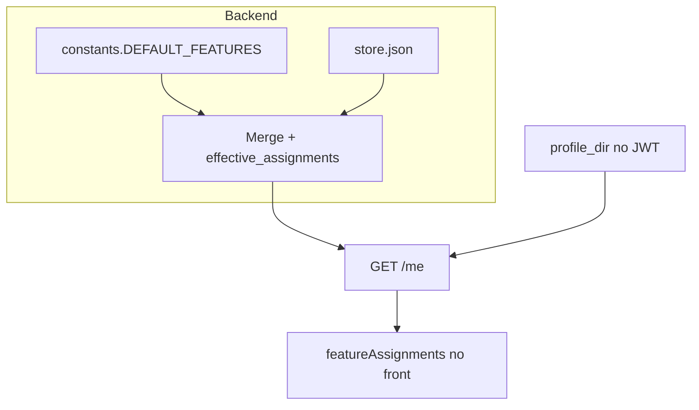

# Feature flags (BabyHealth)

Guia de como o módulo funciona, onde cadastrar **features** e **perfis**, e quais partes do código participam.

## Visão geral

- **Catálogo**: chaves de feature (ex.: `activities_tile`), lista de **variantes** permitidas (ex.: `v1`, `v2`) e **default**.
- **Overrides por perfil**: mapas por `profileId` no JSON da store. O JWT do app usa **`profile_dir`** do usuário; para o `/me` refletir overrides, a chave em `profiles` deve ser **igual** a esse `profile_dir` (ex.: `davi`).
- **Resolução efetiva**: defaults do catálogo → camada `profiles.default` → camada `profiles.<profileId>`. Implementação: `FeatureFlagStore.effective_assignments()` em [`backend/feature_flags/store.py`](../backend/feature_flags/store.py).



## Ativar o módulo

Variáveis na **raiz** do repositório (`.env`; não versionado). Resumo:

| Variável | Descrição |
|----------|-----------|
| `FEATURE_FLAGS_ENABLED` | `1` / `true` / `yes` para registrar `/api/feature-flags/*` |
| `FEATURE_FLAGS_TOTP_SECRET` | Segredo Base32 (ex.: `openssl rand -base32 20`) para rotas de **gestão** |
| `FEATURE_FLAGS_STORE_PATH` | Opcional; padrão `backend/data/feature_flags/store.json` |

Detalhes e links do front: [`LOCAL_RUN.md`](../LOCAL_RUN.md) (seção Feature flags).

O router só é incluído se `FEATURE_FLAGS_ENABLED` estiver ativo — ver [`backend/main.py`](../backend/main.py).

## Cadastrar **features** (catálogo)

### 1. Código (defaults e primeiro arquivo)

Arquivo [`backend/feature_flags/constants.py`](../backend/feature_flags/constants.py):

- **`DEFAULT_FEATURES`**: cada chave é o id da feature; valor com `variants`, `defaultVariant`, `description`.
- **`default_store_document()`**: forma inicial do JSON quando o arquivo da store **ainda não existe** (inclui `features` + `profiles` de exemplo).

### 2. Arquivo JSON (persistência)

Caminho padrão: [`backend/data/feature_flags/store.json`](../backend/data/feature_flags/store.json) (ou o path em `FEATURE_FLAGS_STORE_PATH`).

Na carga, o store faz **merge** de `features` do disco com `DEFAULT_FEATURES` — chaves novas no código entram; o arquivo pode complementar/sobrescrever metadados.

### 3. API

- **`GET /api/feature-flags/catalog`** — público; lista chaves, variantes e default de cada feature.

## Cadastrar **perfis** (no sentido de flags)

Não confundir com login:

| Conceito | Onde | Uso |
|----------|------|-----|
| **Perfil de dados** (`profile_dir`) | [`backend/data/users.json`](../backend/data/users.json) + pasta `DATA_DIR/<profile_dir>/` | JWT e dados do bebê |
| **Overrides de flags** | `profiles.<id>` em `store.json` | `id` deve coincidir com `profile_dir` para o **`GET /me`** aplicar overrides daquele usuário |

**Incluir um perfil novo só para flags:**

- Editar `store.json` em `profiles`, **ou**
- `POST /api/feature-flags/assignments` com `"profileId": "<id>"` e `"assignments": { ... }` (ver abaixo).

Para usuários reais: use **`profileId` = `profile_dir`** do `users.json`.

## Gestão (TOTP): ler e alterar assignments

Todas as rotas abaixo exigem módulo ligado. **Nunca** envie OTP na query string.

### Listar assignments (efetivos)

```bash
curl -sS -H "X-TOTP-Code: <6 dígitos>" \
  "http://127.0.0.1:8080/api/feature-flags/assignments"
```

Com um perfil:

```bash
curl -sS -H "X-TOTP-Code: <6 dígitos>" \
  "http://127.0.0.1:8080/api/feature-flags/assignments?profileId=davi"
```

### Alterar (merge por perfil)

`POST /api/feature-flags/assignments` com JSON:

```json
{
  "profileId": "davi",
  "assignments": {
    "activities_tile": "v2",
    "vitamins_tile": "v1"
  }
}
```

- Só as chaves enviadas são atualizadas no perfil; o restante do mapa daquele perfil permanece.
- Chaves devem existir no catálogo; variantes devem estar em `variants` da feature — senão **400**.

Implementação: [`backend/feature_flags/router.py`](../backend/feature_flags/router.py).

## Consumo pelo usuário logado

**`GET /api/feature-flags/me`** — header `Authorization: Bearer <token>`. Resposta inclui `profileId` (o `profile_dir` do token) e `assignments` já resolvidos.

## Frontend (app-design)

| Peça | Arquivo |
|------|---------|
| Chamadas HTTP | [`app-design/src/api/featureFlags.ts`](../app-design/src/api/featureFlags.ts) — `fetchFeatureFlagCatalog`, `fetchMyFeatureFlags` |
| Helper | [`app-design/src/app/lib/featureFlags.ts`](../app-design/src/app/lib/featureFlags.ts) — `getFeatureVariant(key, assignments, fallback?)` |
| Estado global | [`app-design/src/app/UIBootstrapContext.tsx`](../app-design/src/app/UIBootstrapContext.tsx) — após login, chama `/me` e expõe **`featureAssignments`**; em falha (API off, 404, rede) usa `{}` (fallback **v1** na UI) |
| Uso na tela Hoje | [`app-design/src/app/components/pages/TodayPage.tsx`](../app-design/src/app/components/pages/TodayPage.tsx) — resolve `activities_tile` e `vitamins_tile` |
| Layout condicional | [`TodayTrackerGrid.tsx`](../app-design/src/app/components/today/TodayTrackerGrid.tsx), [`TodayHealthSection.tsx`](../app-design/src/app/components/today/TodayHealthSection.tsx) |

**Importante:** hoje só **`activities_tile`** e **`vitamins_tile`** têm ramificações de UI. A chave **`timeline_style`** existe no catálogo, mas **não** há uso no React — adicionar comportamento exige novo código que chame `getFeatureVariant("timeline_style", featureAssignments)` (e componentes correspondentes).

## Checklist: nova feature de ponta a ponta

1. Adicionar entrada em **`DEFAULT_FEATURES`** em `constants.py` (variantes + default).
2. Garantir `store.json` coerente (ou deixar o merge criar/atualizar via deploy).
3. Expor na API automaticamente no **catalog** / **me** / **assignments** (já wired no router).
4. **Frontend:** usar `getFeatureVariant("sua_chave", featureAssignments)` onde a UI deve bifurcar.
5. (Opcional) Testes em [`backend/tests/test_feature_flags.py`](../backend/tests/test_feature_flags.py).

## Testes automatizados

`pytest` **não** carrega o `.env` da raiz no `config` (evita vazamento de flags locais nos testes). Os testes do módulo usam `monkeypatch` de env/path — ver `test_feature_flags.py`.

## Segurança

- **TOTP** protege **GET/POST `/assignments`** (gestão).
- **`/catalog`** é metadado público.
- **`/me`** segue o JWT; não exige TOTP.

Rotacione segredos expostos; não commite `FEATURE_FLAGS_TOTP_SECRET`.
